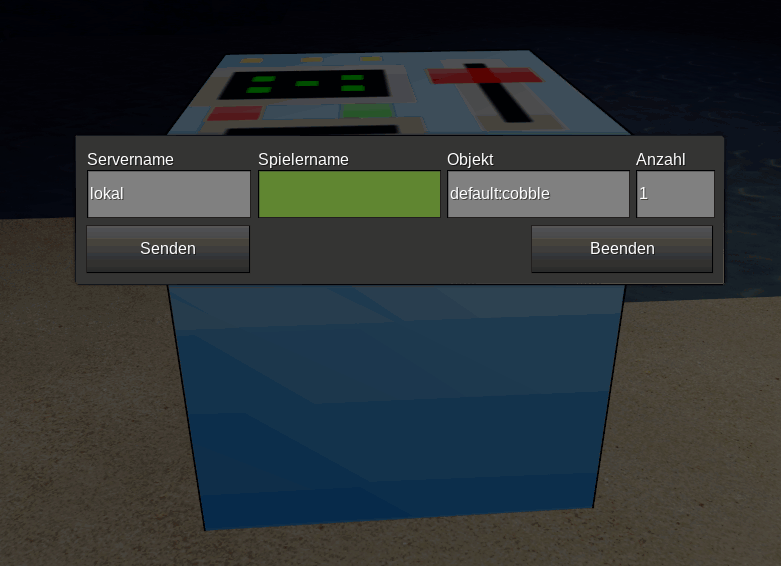

# beamer
A mod for minetest to transport items from the own inventory to the inventory of another player.

## Version
1.0

## Description

Beamer adds a node, where player are able to send items from their inventoriy to the other inventory.
The beamer checks, do you have enough items, is the target player online, have the target player enough room in his inventory, is it allowed to beam in his inventory.

## Licence
GPL 3.0

## Depends
MT 5.0+
